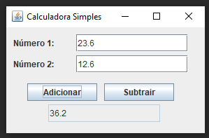

# 📐 Simple Calculator

Uma calculadora simples desenvolvida em Java utilizando a biblioteca Swing para a interface gráfica.

## 📝 Descrição

Esta aplicação de calculadora permite realizar operações básicas de adição e subtração entre dois números. É um exemplo básico de como utilizar componentes Swing para criar uma interface gráfica em Java.

## 🚀 Funcionalidades

- ➕ Adição de dois números
- ➖ Subtração de dois números

## 🛠️ Tecnologias Utilizadas

- Java
- Swing (biblioteca gráfica)

## 📋 Pré-requisitos

- Java Development Kit (JDK) 8 ou superior

## ▶️ Como Executar

1. Clone o repositório:
    ```bash
    git clone https://github.com/franciscampos91/java-simple-calculator.git
    ```

2. Compile o código:
    ```bash
    javac SimpleCalculator.java
    ```

3. Execute a aplicação:
    ```bash
    java SimpleCalculator
    ```

## 💻 Capturas de Tela



## 📄 Código Fonte

```package samplecalculator;

/**
 *
 * @author franciscampos91
 */
import javax.swing.*;
import javax.swing.text.*;
import java.awt.event.ActionEvent;
import java.awt.event.ActionListener;

public class SimpleCalculator {
    private JFrame frame;
    private JTextField textField1;
    private JTextField textField2;
    private JTextField resultField;
    private JButton addButton;
    private JButton subtractButton;

    public SimpleCalculator() {
        frame = new JFrame("Calculadora Simples");
        frame.setDefaultCloseOperation(JFrame.EXIT_ON_CLOSE);
        frame.setSize(300, 190);
        frame.setLayout(null);

        JLabel label1 = new JLabel("Número 1:");
        label1.setBounds(10, 10, 80, 25);
        frame.add(label1);

        textField1 = new JTextField();
        ((AbstractDocument) textField1.getDocument()).setDocumentFilter(new NumberDocumentFilter());
        textField1.setBounds(100, 10, 160, 25);
        frame.add(textField1);

        JLabel label2 = new JLabel("Número 2:");
        label2.setBounds(10, 40, 80, 25);
        frame.add(label2);

        textField2 = new JTextField();
        ((AbstractDocument) textField2.getDocument()).setDocumentFilter(new NumberDocumentFilter());
        textField2.setBounds(100, 40, 160, 25);
        frame.add(textField2);

        addButton = new JButton("Adicionar");
        addButton.setBounds(30, 80, 100, 25);
        frame.add(addButton);

        subtractButton = new JButton("Subtrair");
        subtractButton.setBounds(140, 80, 100, 25);
        frame.add(subtractButton);

        resultField = new JTextField();
        resultField.setBounds(60, 110, 160, 25);
        resultField.setEditable(false);
        frame.add(resultField);

        addButton.addActionListener(new ActionListener() {
            public void actionPerformed(ActionEvent e) {
                performAddition();
            }
        });

        subtractButton.addActionListener(new ActionListener() {
            public void actionPerformed(ActionEvent e) {
                performSubtraction();
            }
        });

        frame.setLocationRelativeTo(null);
        frame.setVisible(true);
    }

    private void performAddition() {
        double num1 = Double.parseDouble(textField1.getText());
        double num2 = Double.parseDouble(textField2.getText());
        double result = num1 + num2;
        resultField.setText(String.valueOf(result));
    }

    private void performSubtraction() {
        double num1 = Double.parseDouble(textField1.getText());
        double num2 = Double.parseDouble(textField2.getText());
        double result = num1 - num2;
        resultField.setText(String.valueOf(result));
    }

    public static void main(String[] args) {
        new SimpleCalculator();
    }
}

class NumberDocumentFilter extends DocumentFilter {
    @Override
    public void insertString(FilterBypass fb, int offset, String string, AttributeSet attr) throws BadLocationException {
        if (string == null) {
            return;
        }
        if (isNumeric(string, fb.getDocument().getText(0, fb.getDocument().getLength()))) {
            super.insertString(fb, offset, string, attr);
        }
    }

    @Override
    public void replace(FilterBypass fb, int offset, int length, String text, AttributeSet attrs) throws BadLocationException {
        if (text == null) {
            return;
        }
        if (isNumeric(text, fb.getDocument().getText(0, fb.getDocument().getLength()))) {
            super.replace(fb, offset, length, text, attrs);
        }
    }

    @Override
    public void remove(FilterBypass fb, int offset, int length) throws BadLocationException {
        super.remove(fb, offset, length);
    }

    private boolean isNumeric(String str, String currentText) {
        if (str.equals(".")) {
            return !currentText.contains(".");
        }
        try {
            Double.parseDouble(str);
            return true;
        } catch (NumberFormatException e) {
            return false;
        }
    }
}

```
